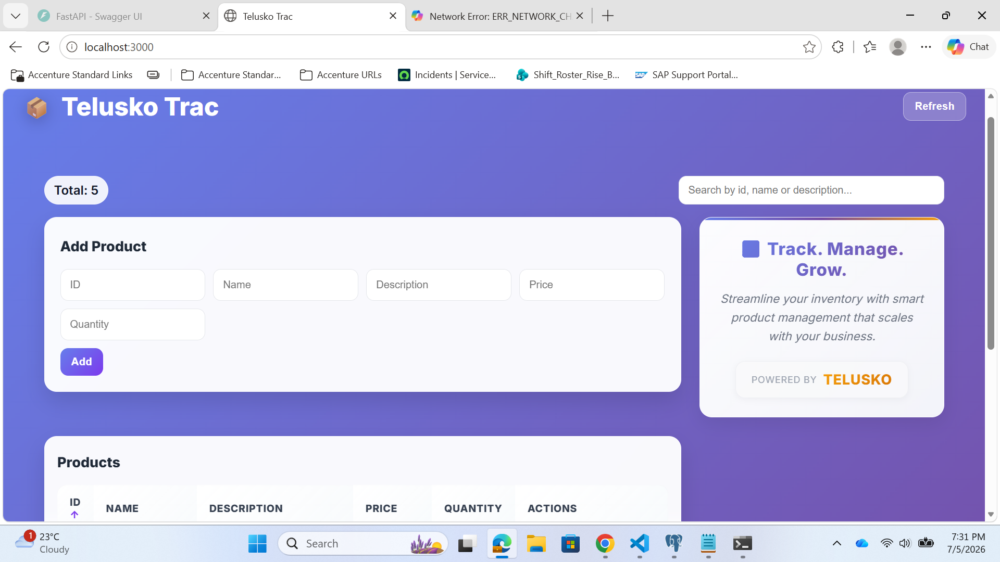
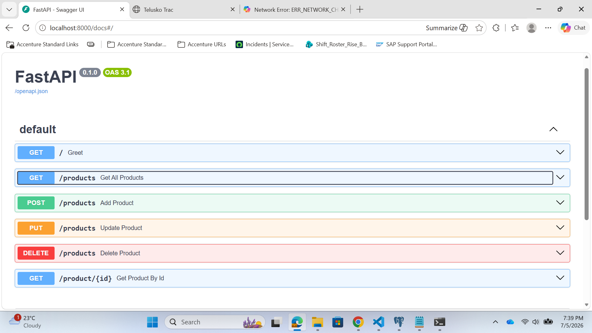

# Product Management System

A full-stack Product Management System built using React.js and FastAPI. This application allows users to manage products through CRUD (Create, Read, Update, Delete) operations.

## Features

- Add New Products
- View Product List
- Update Existing Products
- Delete Products
- FastAPI REST APIs
- React User Interface
- Swagger API Documentation

## Tech Stack

### Frontend
- React.js
- Axios
- CSS

### Backend
- FastAPI
- Python
- SQLAlchemy

### Database
- SQLite

## Project Structure

```text
product-management-system
│
├── frontend/
├── database.py
├── database_models.py
├── main.py
├── models.py
├── requirements.txt
└── README.md
```

## Run Backend

```bash
uvicorn main:app --reload
```

Backend URL:

```text
http://localhost:8000
```

Swagger Documentation:

```text
http://localhost:8000/docs
```

## Run Frontend

```bash
cd frontend
npm install
npm start
```

Frontend URL:

```text
http://localhost:3000
```

## Screenshots

### Home Page



### Swagger Documentation



## Author

Pooja Mohite